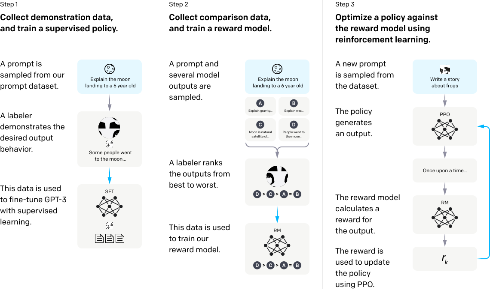
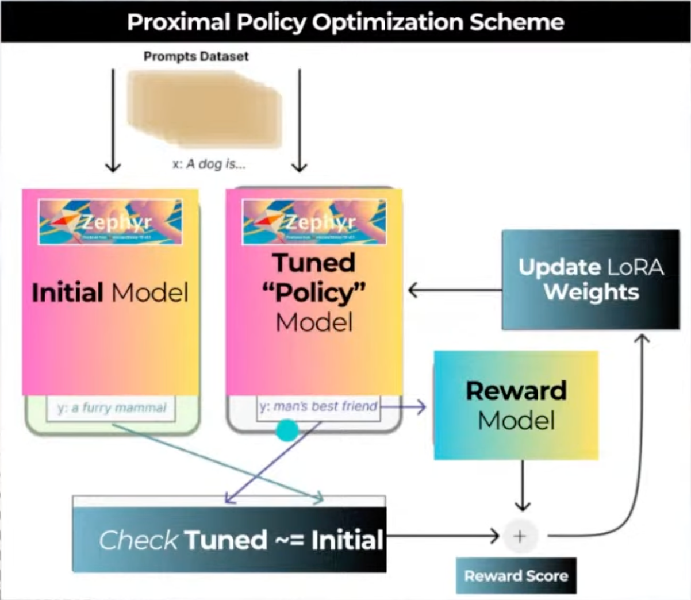

## Aligning LLMs with RLHF

Reinforcement Learning from Human Feedback (RLHF) was introduced in 2017 by Christiano et al. in the paper [Deep Reinforcement Learning from Human Feedback](https://arxiv.org/abs/1706.03741).

The idea of aligning LLMs with RLHF was introduced in the model [InstructGPT](https://arxiv.org/pdf/2203.02155.pdf) which consists of the following diagram:

The idea is to leverage human feedback to align with us on what it means to be “helpful, honest, and harmless.”

Below is the diagram of the alignment used in the Zephy-7B RLHF notebooks:

